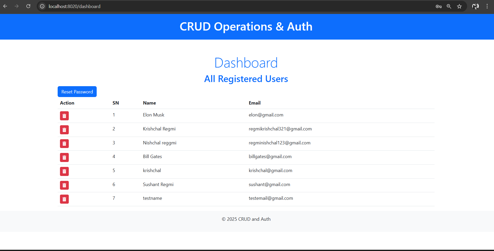
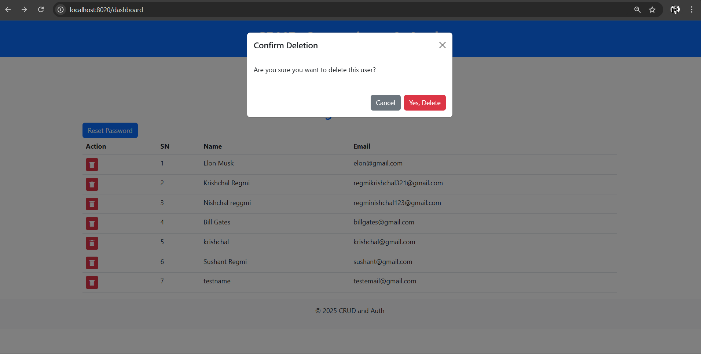
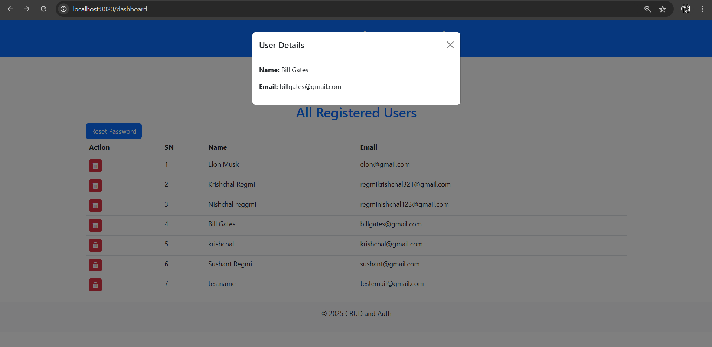
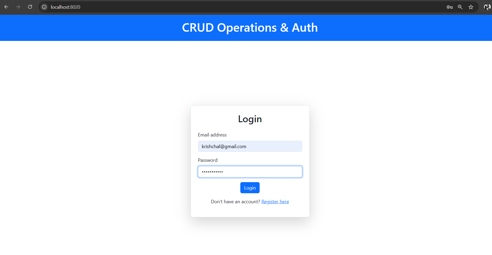
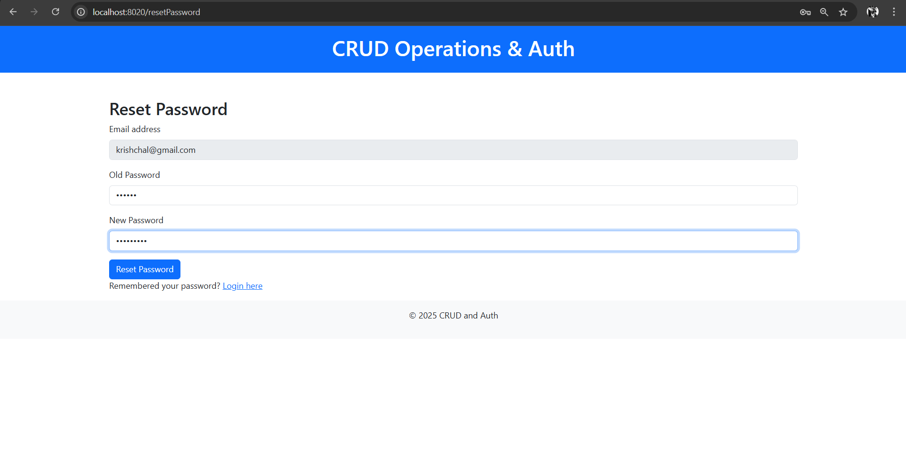
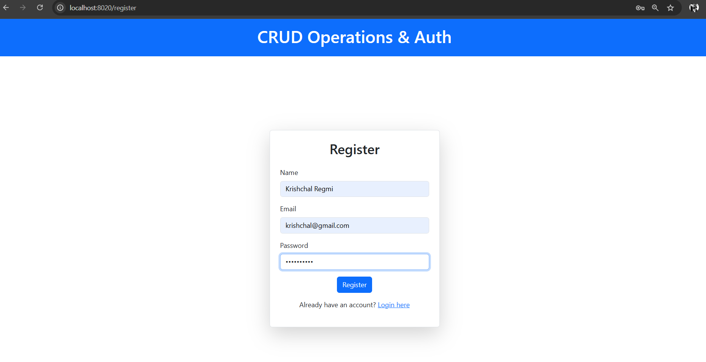

# CRUD Application

This project is a CRUD (Create, Read, Update, Delete) web application built with Node.js, Express, MongoDB, and EJS. It provides user management features, including registration, login, user listing, and deletion, along with modals for displaying user details and confirming deletions.

## Key Features

1. **User Management**:
   - Register new users with validation.
   - Login functionality with authentication.
   - Display all registered users in a tabular format.
   - Delete users with a confirmation modal.

2. **Interactive UI**:
   - Modals for viewing user details and confirming actions.
   - Responsive design using Bootstrap.

3. **Secure Backend**:
   - Authentication using JSON Web Tokens (JWT).
   - Environment variables for sensitive data (managed via `.env`).


4. **RESTful API**:
   - Endpoints for user operations like fetching, deleting, and authentication.

## Tech Stack

### Backend:
- **Node.js**: JavaScript runtime for server-side logic.
- **Express.js**: Web framework for creating routes and APIs.
- **MongoDB**: NoSQL database for storing user data.
- **Mongoose**: ODM for MongoDB to manage schemas and data interactions.

### Frontend:
- **EJS**: Templating engine for dynamic rendering.
- **Bootstrap**: CSS framework for responsive design.
- **JavaScript**: Client-side scripting.

## Installation and Setup

1. **Clone the repository**:
   ```bash
   git clone https://github.com/Krishchal/CRUD-Auth-with-Node.js-and-EJS.git
   cd CRUD-App
   ```

2. **Install dependencies**:
   ```bash
   npm install
   ```

3. **Setup environment variables**:
   Create a `.env` file in the root directory and specify the following:
   ```env
   PORT=3000
   MONGO_URI=<your-mongodb-uri>
   JWT_SECRET=<your-secret-key>
   ```

4. **Run the application**:
   ```bash
   npm start
   ```
   The app will be available at `http://localhost:3000`.

## Folder Structure

```
CRUD-App/
├── config/           # Configuration files
├── controllers/      # Request handling logic
├── middlewares/      # Middleware functions
├── models/           # Mongoose schemas and models
├── public/           # Static files (CSS, JS, images)
├── routes/           # API and view routes
├── views/            # EJS templates
├── .env              # Environment variables (not included in version control)
├── index.js          # Application entry point
├── package.json      # Dependencies and scripts
└── requirements.txt  # (Optional)
```

## Usage Instructions

### Registering Users
- Navigate to `/register` to create a new user.
- Fill out the form with the required details and submit.

### Logging In
- Navigate to `/login` and enter your credentials to access the dashboard.

### Managing Users
- View all users in a table on the dashboard.
- Click the trash icon to delete a user (requires confirmation).
- Click a table row to view user details in a modal.

## API Endpoints

### User Management
- `POST /api/v1/users/register`: Register a new user.
- `POST /api/v1/users/login`: Authenticate a user and return a token.
- `GET /api/v1/users/allUsers`: Fetch all registered users (authentication required).
- `DELETE /api/v1/users/deleteUser`: Delete a user by email (authentication required).

## Screenshots 

### Dashboard


### Delete Confirmation Popup


### User Details Popup


### Login Page


### Reset Password Page


### User Registration Page



## Contributors
- **Krishchal Regmi**

---
For any issues or contributions, feel free to open an issue or submit a pull request.
